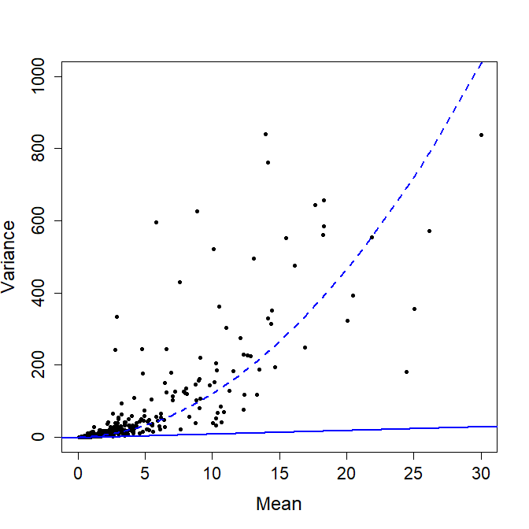
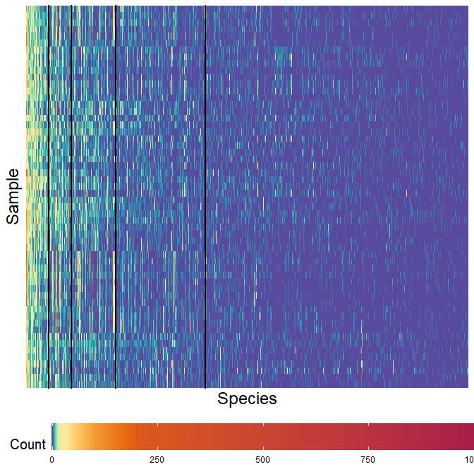
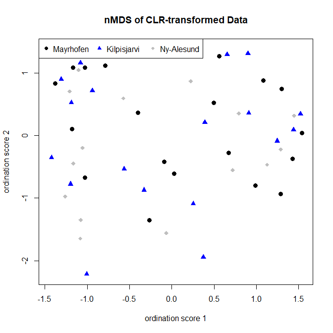
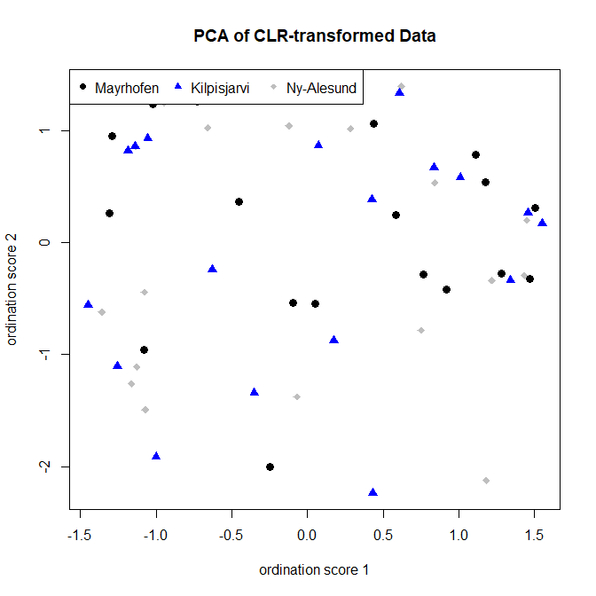
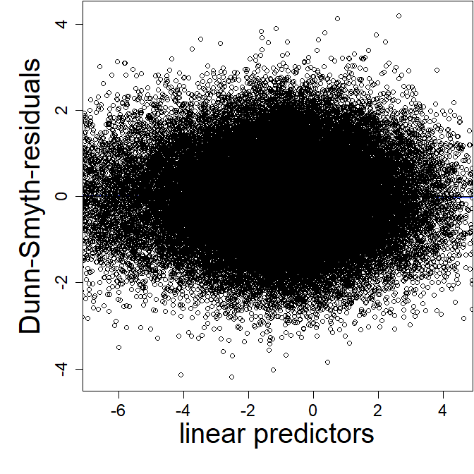
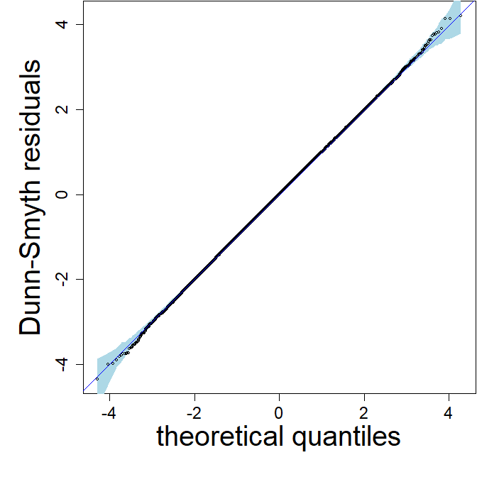
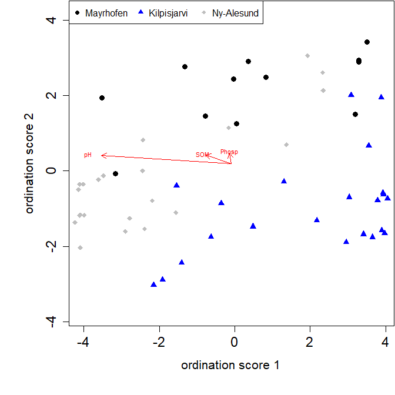
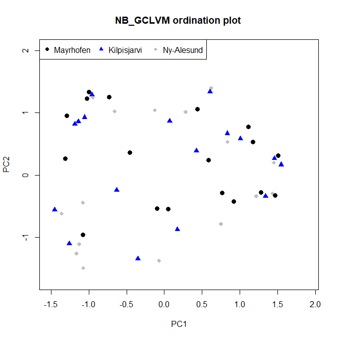

Workflow illustration to compare ordination methods in the analysis of
high-dimensional compositional count data using a  microbiome data set
================
Wenqi tang
2025-03-19

This document reproduces the main content of the introduction and
simulation section of the paper **Comparing model-based unconstrained
ordination methods in the analysis of high-dimensional compositional
count data** by Wenqi Tang, Pekka Korhonen, Jenni Niku, Klaus Nordhausen
and Sara Taskinen. It includes microbiome data visualization and example
about how to handle compositional data and apply ordination methods in R
within the simulation section in paper. We primarily introduce the four
distinct ordination methods mentioned in the paper, which are applicable
to high-dimensional compositional count data. Specifically, we explore
classical ordination methods, Generalized Linear Latent Variable
Models(GLLVMs)-based ordination methods, and copula-based(GCLVM)
ordination methods, applying them to microbiome data in R package
`gllvm` and detailed introduction of dataset is in Kumar et al. (2017).
The dataset used in this analysis consists of a 56 × 985 matrix,
representing 985 bacterial species sampled from 56 soil sites across
three distinct climatic regions: NyÅlesund (high Arctic), Kilpisjärvi
(low Arctic), and Mayrhofen (European Alps) Kumar et al. (2017). Due to
biological or technical factors, such datasets often contain a
significant proportion of zero observations (e.g., 63% zeros in the
microbiome data). Additionally, microbiome data exhibit a compositional
nature, as highlighted in Gloor et al. (2016), meaning the data
represent relative abundances rather than absolute counts.

## Data preprocess

We preprocess data by ordering the columns according to sparseness and
use a heatmap to visualize the sparsity of the data and a mean-variance
plot to assess the overdisperison of the data (Figure 1).

``` r
library(robCompositions)
library(vegan)
library(devtools) # Load devtools for package installation
#devtools::install_github("JenniNiku/gllvm") # Install the latest gllvm package from GitHub
library(gllvm) # Load the gllvm package
source_url("https://raw.githubusercontent.com/tangwenq/microbial-data/main/GCLVM.R")
library(reshape2) # For data reshaping
library(scales)
library(TMB)

# Base the simulations to arctic microbialdata from Nissinen et al.
# Data included in gllvm package

data("microbialdata")
data <- microbialdata$Y
# order columns according to sparseness
data.s <- cbind(1:dim(data)[2], apply(data == 0, 2, sum))
ind <- data.s[order(data.s[, 2], decreasing = FALSE), 1]
data <- data[, ind]
dim(data)
```

    ## [1]  56 985

``` r
# Draw mean-variance plot, (shown in right picture of Figure 1)

# Compute mean and variance for each column
means <- apply(data, 2, mean) # Column-wise means
variances <- apply(data, 2, var) # Column-wise variances

# Define a Negative Binomial (NB) variance function
nb_model <- function(mean, theta) {
  mean + mean^2 * theta # NB variance formula
}

# Fit the NB model to the data using nonlinear least squares
fit <- nls(variances ~ nb_model(means, theta),
  start = list(theta = 0.1)
) # Use an initial guess for theta

# Extract the optimal dispersion parameter (theta)
theta_opt <- coef(fit)["theta"] # Extract the estimated theta value
cat("Optimal dispersion parameter (theta):", theta_opt, "\n")
```

    ## Optimal dispersion parameter (theta): 1.114091

``` r
# Plot mean-variance relationship
plot(means, variances,
  xlab = "Mean", # X-axis label
  ylab = "Variance", # Y-axis label
  pch = 16,
  cex = 0.7, # Point size
  col = "black",
  xlim = c(0, 30), # Limit for X-axis
  ylim = c(0, 1000), # Limit for Y-axis
  cex.lab = 1.5, # Label font size
  cex.axis = 1.4, # Axis font size
  cex.main = 1.6
) # Title font size

# Add a Poisson reference line (variance = mean)
abline(a = 0, b = 1, col = "blue", lwd = 2) # Poisson variance line

# Add the Negative Binomial relationship line
theta <- theta_opt # Use the estimated dispersion parameter
nb_variance <- means + means^2 * theta # Compute NB variance
lines(sort(means), sort(nb_variance),
  col = "blue", lwd = 2, lty = 2
) # Add the NB variance line (dashed)
```



``` r
# Draw heatmap of data, (shown in left picture of Figure 1)

# Convert data to long format for plotting
long_data <- melt(data, varnames = c("Site", "Species"), value.name = "Richness")


# Generate the heatmap
ggplot(long_data, aes(x = Species, y = Site, fill = Richness)) +
  geom_tile() +
  scale_fill_gradientn(
    colors = rev(hcl.colors(n = 8, palette = "Spectral")), # Reverse gradient colors
    values = rescale(c(0, 2, 5, 10, 15, 50, 100, 200, 1024)), # Emphasize 0-15 range
    oob = scales::squish, # Handle out-of-bounds values
    limits = c(0, 1024) # Set gradient range
  ) +
  theme_minimal() + # Minimal theme
  labs(
    x = "Species",
    y = "Sample",
    fill = "Count" # Axis and legend labels
  ) +
  theme(
    axis.text.x = element_text(size = 14, face = "bold", angle = 90, hjust = 1), # Bold x-axis text
    axis.text.y = element_blank(), # Remove y-axis labels
    axis.ticks = element_blank(), # Remove axis ticks
    axis.title.x = element_text(size = 18),
    axis.title.y = element_text(size = 18),
    legend.title = element_text(size = 15),
    legend.text = element_text(size = 9),
    legend.position = "bottom",
    legend.direction = "horizontal"
  ) +
  scale_x_discrete(
    breaks = c(50, 100, 200, 400), # Specify discrete breaks if Species are numbered
    labels = c("50", "100", "200", "400") # Custom labels
  ) +
  geom_vline(
    xintercept = c(50, 100, 200, 400),
    color = "black",
    linetype = "solid", # Use solid lines for emphasis m = 50, 100, 200, 400
    size = 1
  ) +
  guides(
    fill = guide_colorbar(
      barwidth = 32,
      barheight = 2,
      breaks = seq(0, 250, by = 50)
    )
  )
```



## Classical ordination

Classical methods for unconstrained ordination, such as **non-metric
multidimensional scaling (nMDS)** and **principal component analysis
(PCA)**, are widely used due to their computational efficiency and ease
of implementation. Compositional data are subject to sum constraints,
require **centered log-ratio (clr) transformation** in R package
`robCompositions` to map compositional data from the Aitchison space to
real space before applying these methods. For nMDS, the Euclidean
distance can be used to evaluate the clr-transformed data by specifying
`distance = "euclidean"`. Alternatively, for the original compositional
data, dissimilarity measures such as the Bray-Curtis distance
`distance = "bray"` can be applied using the R package `vegan`.

## Example

In the following analysis, we demonstrate the application of classical
ordination methods to compositional data.

``` r
y = data # full dataset as example
# Distance-based methods: nMDS

    fit_mds <- metaMDS(y, distance = "bray", trace = FALSE)
    mds_ords <- scale(fit_mds$ points) # extract ordinations from nMDS
    
    # PCA and nMDS on CLR-transformed data
    clr_y <- cenLR(y + 1) # CLR transformation of data with added 1

    fit_clrmds <- metaMDS(clr_y$x.clr, distance = "euclidean", autotransform = FALSE, noshare = FALSE, wascores = FALSE, trace = FALSE)
    clrmds_ords <- scale(fit_clrmds$points)
    
    fit_pca <- prcomp(clr_y$x.clr, scale = TRUE) # PCA on the CLR-transformed data clr_y
    pca_ords <- scale(fit_pca$x[, 1:2]) # extract ordinations from PCA
```

The microbiome data was collected from three regions: “Mayrhofen,”
“Kilpisjarvi,” and “Ny-Alesund.” To analyze the community structure of
these data, we can visualize the ordinations extracted using classical
methods by plotting ordination plots. The following code demonstrates
how to perform ordination analysis on CLR-transformed data using PCA as
an example and visualize the results. We can find that classical methods
are lack of a probabilistic framework, challenges in handling zero
values.

``` r
# Extract unique regions and symbols
regions <- unique(microbialdata$X$Region) # Unique region names
pch_values <- as.numeric(factor(regions)) + 15 # Define symbols manually: circle (15), triangle (16), plus (17)
colors <- c("black", "blue", "grey")[as.numeric(factor(regions))] # Set specific colors for each region


region_names <- c("Mayrhofen", "Kilpisjarvi", "Ny-Alesund")


# draw ordination plot for nMDS

plot(pca_ords[, 1], pca_ords[, 2], type = "n", 
     xlab = "ordination score 1", ylab = "ordination score 2", main = "nMDS of CLR-transformed Data")
points(clrmds_ords[, 1], clrmds_ords[, 2], col = colors[as.numeric(factor(regions))], 
       pch = pch_values[as.numeric(factor(regions))], cex = 1.2) 


legend("topleft",                      
       legend = region_names,       
       pch = pch_values,               
       col = colors,                    
       ncol = 3,                        
       cex = 1)  
```



``` r
# draw ordination plot for pca
plot(pca_ords[, 1], pca_ords[, 2], type = "n", 
     xlab = "ordination score 1", ylab = "ordination score 2", main = "PCA of CLR-transformed Data")
points(pca_ords[, 1], pca_ords[, 2], col = colors[as.numeric(factor(regions))], 
       pch = pch_values[as.numeric(factor(regions))], cex = 1.2) 


legend("topleft",                      
       legend = region_names,       
       pch = pch_values,               
       col = colors,                    
       ncol = 3,                        
       cex = 1)
```



Results from different regions were represented using distinct colors
and symbols. From the ordination plots of PCA and nMDS, it is evident
that the sample points from the three regions are highly intermixed,
showing no clear clustering or separation trends. This indicates that
these methods fail to effectively capture any structure related to the
three regions. Specifically, under conditions of high sparsity,
classical ordination methods such as PCA and nMDS are unable to
adequately reveal the underlying regional patterns.

## Ordination based on latent variable models (GLLVM)

Generalized Linear Latent Variable Models (GLLVMs) provide a flexible
framework for jointly modeling multivariate response data, such as
microbial count data. GLLVMs extend Generalized Linear Models (GLMs) by
incorporating correlations among response variables using a
factor-analytic approach. This allows GLLVMs to be used for model-based
ordination for any response type. Assume
$\boldsymbol{u}_i = (u_{i1}, \dots, u_{id})^\top$ is a $d$-dimensional
latent variable following a standard multivariate normal distribution
$\boldsymbol{u}_i \sim N(\boldsymbol{0}, \boldsymbol{I}_d)$. In GLLVMs,
it is assumed that, conditional on the latent variables
$\boldsymbol{u}_i$, the response variables $y_{ij}$ are independently
distributed according to some distribution
$F(\mu_{ij}, \boldsymbol{\phi})$, where
$\mu_{ij} = \mathbb{E}(y_{ij} | \boldsymbol{u}_i)$ is the conditional
mean, and $\boldsymbol{\phi}$ includes possible response-specific
parameters (e.g., dispersion or zero-inflation parameters). When GLLVMs
are used for model-based ordination, $\mu_{ij}$ is linked to the linear
predictor via:
$$ g(\mu_{ij}) = \alpha_i + \beta_{0j} + \boldsymbol{\lambda}_j^\top \boldsymbol{u}_i,
$$ where:

\- $g(\cdot)$ is a known link function (typically the log-link for count
data).

\- $\beta_{0j}$ is a column-specific intercept to account for
differences in column totals.

\-$\boldsymbol{\lambda}_j = (\lambda_{j1}, \dots, \lambda_{jd})^\top$ is
a $d$ -dimensional vector of factor loadings.

\- $\alpha_i$ is a row-specific intercept to account for differences in
row totals.

To ensure model identifiability, the upper triangular part of the factor
loading matrix
$\boldsymbol{\Lambda} = [\boldsymbol{\lambda}_1 \cdots \boldsymbol{\lambda}_m]^\top$
is set to zero, and its diagonal elements are set to positive values.

The `gllvm` package implements the **Zero-Inflated Negative
Binomial(ZINB)**(`family = "ZINB"`) and **Negative Binomial
(NB)**(`family = "negative.binomial"`) to better handle datasets with a
large number of zeros. For non-normal response data, the Variational
Approximation (VA) method is typically used to approximate the marginal
log-likelihood function.

## Example

It should be noted that we can speed up computations by enabling
parallelization for `gllvm` with the following code:
`TMB::openmp(n = parallel::detectCores() - 1, autopar = TRUE, DLL = "gllvm")`
This code should be executed before fitting the model with `gllvm()`.
However, due to randomness, the final results may differ slightly from
those presented here. Additionally, since the `gllvm` package on GitHub
is continuously updated, using the latest version installed via
`devtools::install_github("JenniNiku/gllvm")` may also lead to slightly
different results. Nevertheless, these differences will not be
substantial.

To fit the model:

``` r
# Fit GLLVMs with NB distribution with full data
# Extract and scale environmental covariates
X <- scale(microbialdata$Xenv[, c("SOM", "pH", "Phosp")])

# Uncomment to fit unconstrained model
#ungllvm_NB <- gllvm(
  #y = y, family = "negative.binomial", sd.errors = FALSE,
 # row.eff = "fixed", num.lv = 2, seed = 123
#)


# Constrained concurrent model
gllvm_NB <- gllvm(
  y = y, X=X,family = "negative.binomial", sd.errors = FALSE,
  row.eff = "fixed", num.lv.c = 2, seed = 123
)


scale(gllvm_NB$lvs) # extract ordinations
```

    ##             CLV1          CLV2
    ## AB2   0.20504596  0.1556726366
    ## AB3   0.50294578 -0.5323084229
    ## AB4   1.59139308 -0.4754309860
    ## AB5   0.10928355 -1.3870721324
    ## AT2   1.04020795 -0.1712338185
    ## AT3   0.25489143 -0.8588343791
    ## AT4   2.53684581  3.3246203959
    ## AT5   1.57094012 -1.7172841721
    ## CB2   1.73725885 -0.5682470589
    ## CB3   1.67297276 -0.9314972577
    ## CB4   1.42170829 -0.4687914501
    ## CB5   1.17404637 -0.3556879785
    ## JNB2 -0.67001339  1.3916477270
    ## JNB3 -0.81712840  1.5652362649
    ## JNB4 -0.95272062  1.5565567798
    ## JNB5 -1.09256363  1.5636925053
    ## JNT2  0.03221374  0.4755454140
    ## JNT3 -0.30002041  1.0641901019
    ## JNT4 -0.57073711  0.9627137931
    ## JNT5 -0.47616587  0.9855860147
    ## JOB2 -2.08319777 -1.0171333637
    ## JOB3 -1.31578044 -0.9740682582
    ## JOB4 -1.53442771 -0.6907974669
    ## JOB5 -0.68566459 -0.5283077861
    ## JOT2  0.17297512 -1.0273497994
    ## JOT3 -0.26637082 -0.9592068951
    ## JOT4 -0.81787907 -0.0693965313
    ## JOT5  0.13351386 -0.5814659976
    ## KB2  -0.40659742  0.3330923645
    ## KB3  -0.70002480 -0.1243855611
    ## KB4  -1.13011313 -0.0050520351
    ## KB5  -0.86819134  0.0577880910
    ## KT2   0.21742079  0.3206696229
    ## KT3   0.57665579 -1.0602989583
    ## KT4  -0.95454079 -1.2200629805
    ## KT5   0.46163235 -1.5420339448
    ## MB3  -0.42492920 -0.2920285960
    ## MB4   0.73028583 -0.0001347998
    ## MB5   1.56615584  0.4074170292
    ## MT3   0.34276577 -0.8518197665
    ## MT4   1.70526917 -0.6313211993
    ## MT5   0.55734379  1.2109389114
    ## RRB2  0.08756319 -0.8795575208
    ## RRB3 -0.67035990  0.4307176046
    ## RRB4 -0.61402941  0.1439965393
    ## RRB5 -1.38265915  0.0513271444
    ## RRT2 -0.17734447 -0.4076313419
    ## RRT3 -0.28704270  0.3500336071
    ## RRT4 -0.35046502 -0.1287698729
    ## RRT5 -0.23272261 -0.8722765987
    ## SB3  -1.57023752  1.3855979822
    ## SB4  -1.05869780  1.6768239922
    ## SB5  -0.36043494  1.7914939192
    ## ST3   0.92859877 -0.5669650448
    ## ST4   0.75150233  0.1846246025
    ## ST5   0.68962371  0.5064689312
    ## attr(,"scaled:center")
    ##         CLV1         CLV2 
    ## -0.003480643  0.000327171 
    ## attr(,"scaled:scale")
    ##     CLV1     CLV2 
    ## 1.008784 1.008814

Through the `summary()`, `AIC()` or `BIC()` functions, we can observe
the AIC and BIC values of the model, which can also be found in **Table
2** of the paper.

``` r
AIC(gllvm_NB)
```

    ## [1] 126580.1

``` r
BIC(gllvm_NB)
```

    ## [1] 162243.1

For model-based methods, we can use the following code in `gllvm` to
generate residuals plots and ordination plots for analysis, assessing
the model’s fitting performance.

``` r
# Visualize residuals for  NB-GLLVM model(reproduces Figure 8)


# the D-S of concurrent NB-GLLVM model, shown in bottom row in Figure 8
par(mar = c(6, 6, 0, 0) + 0.1) # Set plot margins
plot(gllvm_NB,
  which = 1, #when which = 1, it produces a residuals plot
  caption = " ",
  var.colors = 1,
  cex.lab = 2.5,
  cex.axis = 1.5,
  cex.main = 2.5,
  cex = 1
)
```



``` r
par(mar = c(6, 6, 0, 0) + 0.1) # Set plot margins
# Q-Q plot of residuals
plot(gllvm_NB,
  which = 2, #when which = 2, it generates a QQ norm plot
  caption = " ", 
  var.colors = 1, 
  cex.lab = 2.5, 
  cex.axis = 1.5, 
  cex.main = 2.5, 
  cex = 1
) 
```



``` r
# Ordination plots models (reproduces Figure 5)
ordiplot(gllvm_NB,
  which.lvs = 1:2,
  s.colors = c("black", "blue", "grey")[as.numeric(factor(microbialdata$X$Region))],
  rotate = TRUE,
  symbols = TRUE,
  pch = as.numeric(factor(microbialdata$X$Region)) + 15,
  main = "",
  ann = FALSE
) # Set symbols based on region

title(xlab = "ordination score 1", ylab = "ordination score 2", cex.lab = 1.3)
# Add a legend with specified colors and symbols
legend("topleft", # Legend position
  legend = region_names, # Legend labels
  pch = pch_values, # Corresponding symbols
  col = colors, # Corresponding colors (black, blue, grey)
  ncol = 3,
  cex = 1
) # Arrange legend in 3 columns
```



In ordination plot, longer arrows represent covariates with the largest
relative effects, and dark red arrows (here associated to pH) indicate
covariates with a significant effect to ordination.

## Ordination based on couplas (GCLVMs)

Copula models couple a marginal model for the data with a multivariate
model that accounts for covariance across responses. Assume
$y_{ij} \sim F_j(\mu_{ij}, \boldsymbol{\phi})$, where
$\mu_{ij} = \mathbb{E}(y_{ij})$, and $\boldsymbol{\phi}$ includes
possible response-specific parameters. The mean $\mu_{ij}$ is linked to
the linear predictor via Generalized Linear Models (GLMs):
$$ g(\mu_{ij}) = \alpha_i + \beta_{0j} $$Where $g(\cdot)$ is a known
link function, $\alpha_i$ and $\beta_{0j}$ are row-specific and
column-specific intercepts,respectively. In the Gaussian Copula model,
count data $y_{ij}$ are mapped to Copula values $z_{ij}$ that follow a
multivariate normal distribution:
$$F_j(y_{ij} - 1) \leq \Phi(z_{ij}) < F_j(y_{ij})$$ where $F_j(\cdot)$
is the cumulative distribution function (cdf) assumed for the $j$-th
column in the data matrix under the marginal GLM, and $\Phi(\cdot)$ is
the cdf of the standard normal distribution. For ordination analysis,
the Copula values $z_{ij}$ are assumed to follow a factor-analytic
model:
$$ z_{ij} = \boldsymbol{\lambda}_j^\top \boldsymbol{u}_i + \epsilon_{ij},
$$ where:

\- $\boldsymbol{u}_i$ is a $d$-dimensional latent variable associated
with the study unit.

\- $\boldsymbol{\lambda}_j$ is a $d$-dimensional vector of factor
loadings.

\-$\epsilon_{ij}$ are independent Gaussian errors with variances.

The GCLVM data is generated based on modified code from Popovic (2021).
The marginal GLMs for the Copula model are fitted using the R package
`gllvm` with `lv.n = 0`.The parameters of the Copula model are estimated
using a two-step procedure **Step 1**: Estimate the marginal
distributions $F_j(\cdot)$ using GLMs suitable for sparse, overdispersed
count data. **Step 2**: Use Monte Carlo Expectation Maximization (MCEM)
to estimate the covariance parameters in the Copula model.

## Example

``` r
 # Uncomment for copula with ZINB distribution
    #c_ZINB <- fit_copula(y, gllvm.fam = "ZINB", reff = "fixed", sd.errors = FALSE, seed = 123, lv.n = 0)

  
  # Copula with NB distribtuion
    c_NB <- fit_copula(y, gllvm.fam = "negative.binomial", reff = "fixed", sd.errors = FALSE, seed = 123, lv.n = 0)
    
    c_NB_ords <- scale(c_NB$scores)# extract ordinations
c_NB_ords
```

    ##       
    ## X1        Factor1     Factor2
    ##   AB2   0.5086721 -0.40566656
    ##   AB3   0.3910121 -0.80810550
    ##   AB4   0.1120420 -1.68871513
    ##   AB5  -0.5901610 -0.85297105
    ##   AT2   1.1239940 -0.72256040
    ##   AT3   0.9562326 -0.99152562
    ##   AT4   1.3290795 -1.09587730
    ##   AT5   0.8605708 -1.52054344
    ##   CB2   1.8956195 -0.20279189
    ##   CB3   1.6794167 -0.04431762
    ##   CB4   1.8605691 -0.12784277
    ##   CB5   1.2186552  0.40141847
    ##   JNB2 -0.5104550  1.75144562
    ##   JNB3 -0.3644541  1.98640575
    ##   JNB4 -0.3182024  2.02576093
    ##   JNB5 -0.1808006  1.89218485
    ##   JNT2  0.1579157  1.32583934
    ##   JNT3  0.1548727  1.63913888
    ##   JNT4  0.2904953  1.62568793
    ##   JNT5  0.1907402  1.60761921
    ##   JOB2 -1.5145978  0.34481828
    ##   JOB3 -1.1408483  0.21752248
    ##   JOB4 -1.4985396  0.42708537
    ##   JOB5 -0.9589541  0.47006082
    ##   JOT2 -0.4184350 -0.40944871
    ##   JOT3 -0.4061376  0.06906395
    ##   JOT4 -0.4360309  0.52002822
    ##   JOT5  0.1381417  0.45972935
    ##   KB2  -1.1620305 -0.81350872
    ##   KB3  -0.7421736 -0.39880746
    ##   KB4  -1.0688515 -0.41772538
    ##   KB5  -1.0617072 -0.23078371
    ##   KT2  -0.6822138 -1.05316729
    ##   KT3   0.4274068 -0.54522170
    ##   KT4  -0.7820316 -0.56302685
    ##   KT5  -0.1393193 -1.05054470
    ##   MB3  -1.2531357 -0.70398342
    ##   MB4   0.6819616  0.11838841
    ##   MB5   1.5751984 -0.14360632
    ##   MT3  -0.5794690 -0.99746851
    ##   MT4   1.9070630 -0.71378283
    ##   MT5   1.7495156 -0.36436648
    ##   RRB2 -0.3918432 -0.74132581
    ##   RRB3 -1.1461906 -0.87158341
    ##   RRB4 -1.2239277 -0.68427923
    ##   RRB5 -1.3619134 -0.49149675
    ##   RRT2 -0.7148746 -0.05287223
    ##   RRT3 -0.8716688 -1.01065087
    ##   RRT4 -0.7735965 -1.19160230
    ##   RRT5 -0.7377482 -1.06170637
    ##   SB3  -0.2822259  1.27884686
    ##   SB4  -0.2679951  1.79840964
    ##   SB5   0.3327811  1.52382676
    ##   ST3   1.5561149  0.20241296
    ##   ST4   0.9442926  0.84033173
    ##   ST5   1.5381695  0.44585055
    ## attr(,"scaled:center")
    ##      Factor1      Factor2 
    ##  0.008504811 -0.017787855 
    ## attr(,"scaled:scale")
    ##  Factor1  Factor2 
    ## 1.006406 1.005247

we can use following code to draw ordination plot and extract model to
check AIC and BIC.

``` r
obj = c_NB$obj #extract model
obj
```

    ## Call: 
    ## gllvm(y = data, family = gllvm.fam, num.lv = lv.n, row.eff = reff, 
    ##     sd.errors = FALSE)
    ## family: 
    ## [1] "negative.binomial"
    ## method: 
    ## [1] "VA"
    ## 
    ## log-likelihood:  -70566.6 
    ## Residual degrees of freedom:  53135 
    ## AIC:  145183.2 
    ## AICc:  145337.6 
    ## BIC:  163242.1

``` r
# draw ordination plot for pca
plot( c_NB_ords[, 1],  c_NB_ords[, 2], type = "n", 
     xlab = "PC1", ylab = "PC2", main = "NB_GCLVM ordination plot ")
points(pca_ords[, 1], pca_ords[, 2], col = colors[as.numeric(factor(regions))], 
       pch = pch_values[as.numeric(factor(regions))], cex = 1.2) 


legend("topleft",                      
       legend = region_names,       
       pch = pch_values,               
       col = colors,                    
       ncol = 3,                        
       cex = 1) 
```



From the ordination plot, it can be observed that while the NB-GCLVM
exhibits a stronger tendency for classification compared to PCA and
nMDS, it still performs less effectively when compared to the NB-GLLVM
visualization.

## References

<div id="refs" class="references csl-bib-body hanging-indent"
entry-spacing="0">

<div id="ref-Glooretal2016" class="csl-entry">

Gloor, Gregory B., Jia Rong Wu, Vera Pawlowsky-Glahn, and Juan José
Egozcue. 2016. “It’s All Relative—Analyzing Microbiome Data as
Compositions” 26: 322–29.
<https://doi.org/10.1016/j.annepidem.2016.03.003>.

</div>

<div id="ref-Kumar2017" class="csl-entry">

Kumar, Manoj, Gerald Brader, Angela Sessitsch, Minna Mäki, Jan Dirk van
Elsas, and Riikka Nissinen. 2017. “Plants Assemble Species-Specific
Bacterial Communities from Common Core Taxa in Three Arcto-Alpine
Climate Zones” 8: 12. <https://doi.org/10.3389/fmicb.2017.00012>.

</div>

<div id="ref-Popovic2021" class="csl-entry">

Popovic, Gordana. 2021. “Fast Model-Based Ordination with
Copulas—Simulation Code (V1.0.0).”
<https://doi.org/10.5281/zenodo.5525716>.

</div>

</div>
